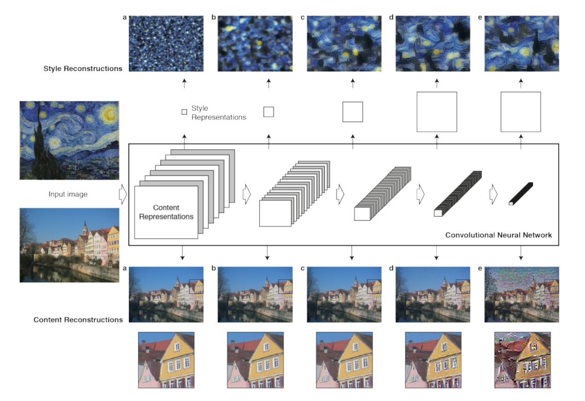
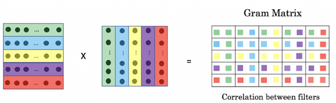
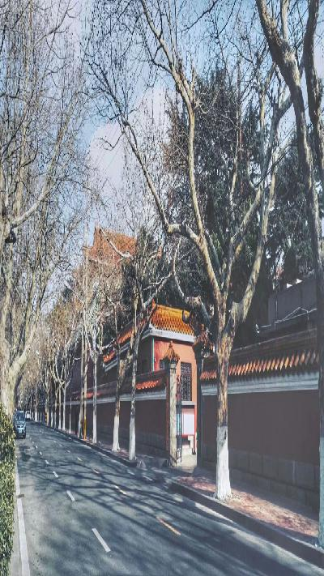
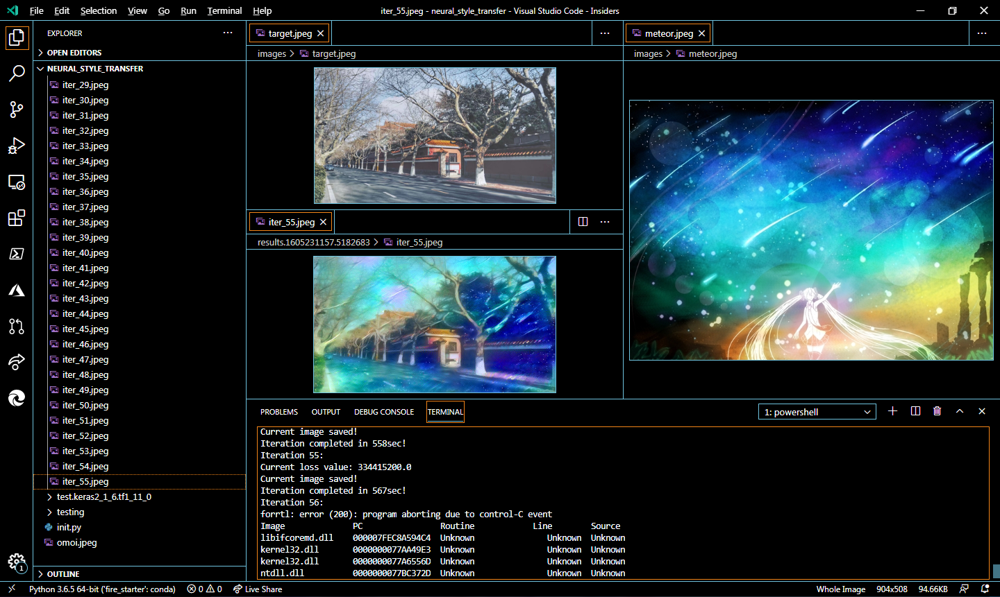
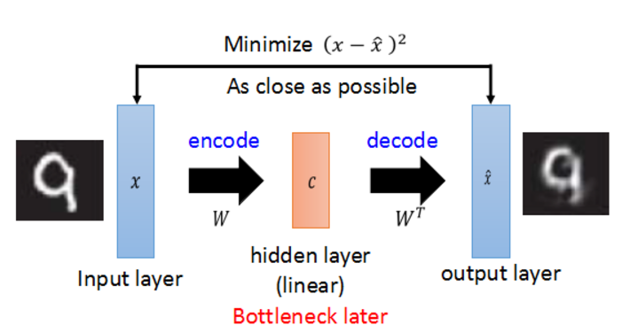
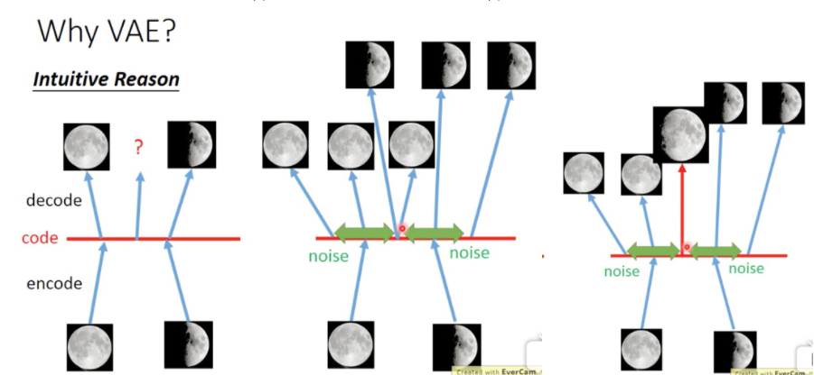
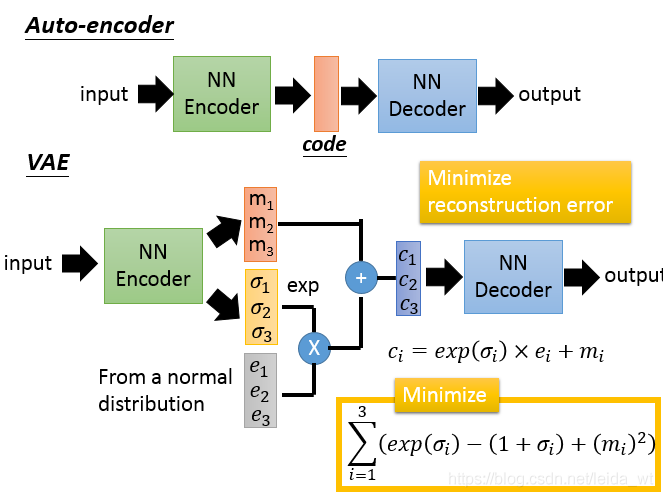
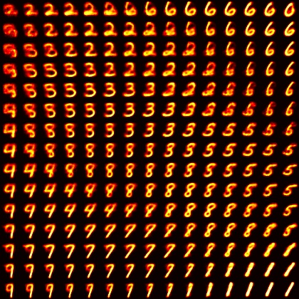



```py
Whereof whats past is prologue, what to come in yours and my discharge.
```

凡此过往，皆为序章。（前方未知的未来，由你我的双手铺就。）


### 2020年11月6日

## Intro

前段时间承蒙导师信任，被安排前去参加曾经梦寐以求的数据科学界的[Kaggle](https://kaggle.com/)竞赛，根据队中哥哥姐姐们的兴趣与他们选定了[Titanic](https://www.kaggle.com/c/titanic/)与[MNIST](https://www.kaggle.com/c/digit-recognizer/)两道题目，~~虽然做的工作很少，但也算是为这两道（大水）题处心积虑煞费苦心~~。

虽由于网络原因尚未提交submission，但这两个project的`accuracy`已经达到预期目标，可以告一段落。

而在后面，还有我们最终要做的[基于`GAN`生成Monet作品](https://www.kaggle.com/c/gan-getting-started/)一项，目前征程尚未结束，我还需要继续努力。~~（但是现在来考虑，至于还要不要做那道题目，可能是未知数，因为我们可能会换作进行别的project）~~

~~(最近要复习数学和代数的期中考试，因此一直没有整理这一块的内容QAQ)~~



## 基于`VGG19`与`L-BFGS-B`优化算法的NST(Neural Style Transfer, 神经样式迁移)

### Abstract

这个project最早是2018年年底在Keras之父所著的《Deep Learning with Python》上关于生成式深度学习一部分看到的，NST这个算法经常被与DeepDream算法一并提起，后者DeepDream是向给定的现实图像注入细节以生成魔幻（非）现实主义的“梦境”图像。

但我们今天讨论的重点在于前者亦即神经样式迁移，这是由Leon A. Gatys, Alexander S. Ecker, Matthias Bethge三人于文献《A Neural Algorithm of Artistic Style》提出的，与DeepDream拥有诸多相同之处。

其目标在于改变现实图像的细节，以使生成图像具备参考图像的画风，例如使一张现实中的青岛市中山路街道夜景变得像梵高画出来的一样，在像这样的过程之中便可以参考梵高的的《Starry Night》以进行变换。

下面这幅图生动传神地刻画了现实图像被注入目标风格的过程~~(，虽说操作的对象并不是中山路街道夜景就是啦)~~



> Keywords:
>
> * Neural Style Transfer (NST)
> * VGG19
> * Gram Matrix
> * L-BFGS-B
>
> ...

### Loss Functions

作为文献作者的Gatys认为在convnet之中图像的`内容`与`样式`被在后面的层中分立表示，例如Gatys老哥用的VGG19中，最后一个block倒数第三个卷积层(即`block5_conv2`)被用于表示进入convnet被处理的现实图像的内容，而每一个block的第一个卷积层(`block1_conv1`，`block2_conv1`...一直到`block5_conv1`都是)皆被用于表示进入convnet被处理的现实图像的样式。

用convnet中不同的层的隐层输出表示内容和样式之后，可以定义相应的内容损失`content_loss`和样式损失`style_loss`，内容损失很好理解其实就是生成图像与现实图像的特征图之间的差量再平方，这就比较类似于我们所熟悉的mse，如若是绝对值的话(我觉得可能)也可以，就比较类似于mae。

与内容损失不同，样式损失通过一个叫做[Gram Matrix](https://planetmath.org/grammatrix)的东西来进行刻画：

$$ G_{i,j}^l = F_{i,k}^l \cdot F_{j,k}^l $$

$$ \Delta(\alpha_1, \alpha_2, \dots, \alpha_k)

= A^T A

= \begin{bmatrix} \alpha_1^T \\ \alpha_2^T \\ \vdots \\ \alpha_k^T \end{bmatrix} \cdot (\alpha_1, \alpha_2, \cdots, \alpha_k)

= \begin{bmatrix}
\alpha_1^T \alpha_1 & \alpha_1^T \alpha_2 & \cdots & \alpha_1^T \alpha_k \\
\alpha_2^T \alpha_1 & \alpha_2^T \alpha_2 & \cdots & \alpha_2^T \alpha_k \\
\vdots              & \vdots              & \ddots & \vdots              \\
\alpha_k^T \alpha_1 & \alpha_k^T \alpha_2 & \cdots & \alpha_k^T \alpha_k \\
\end{bmatrix} $$

或是千言万语不及一幅图？



所以我们可以从公式或者图看出，这个Gram Matrix实质上就是把矩阵视为一个矢量组，让矢量组之间互相点积得到的结果，所以能够反映出矩阵内部矢量与矢量之间的**自相关性**。这样的相关性从convnet较高层一直保留到较低层，从而保留的是样式。特征相互关系捕捉到的是纹理(texture)，生成图像和参考图像纵使在不同的空间尺度上亦应当具有相同的纹理。

除内容与样式之外，我们还要考虑生成图像的连贯性或者说连续性，以避免生成的结果过度像素化以至于令人感到非常违和，因此Gatys老哥还定义了总变差损失`total_variation_loss`，简单地说就是：

> (这个project在梯度下降过程之前用到的只是一些简单的对张量的数值代数处理，因此我们
>
> ```py
> import numpy as np
> import keras, keras.backend as T
> ```
>
> )

```py Total Variation Loss
def total_variation_loss(x):
    a = T.square(
        x[ : , : (img_height - 1) , : (img_width - 1) , : ] -
        x[ : , 1 :                , : (img_width - 1) , : ]
        )
    b = T.square(
        x[ : , : (img_height - 1) , : (img_width - 1) , : ] -
        x[ : , : (img_height - 1) , 1 :               , : ]
        )
    return T.sum(T.pow(a + b, 1.25))
```

对生成图像取了从左上角到倒数第二列倒数第二行的窗口，分别与窗口向右、向下平移一格的窗口作差。这个新定义的损失与我们见过的各种损失同样不可能为零，毕竟除了纯色图之外不可能所有的点与其相邻的点颜色一模一样。明确了三类需要的损失之后，最终需要优化的损失便是三者之和：

$$Loss = Loss_{content} + \sum Loss_{style} + Loss_{variation}$$

### Optimization

采用`L-BFGS-B`算法进行优化，`BFGS`算法是由Broyden, Fletcher, Goldfarb, Shanno四名科学家提出的优化牛顿迭代法的产物，其改进版`L-BFGS`算法中的L指代`limited_memory`即对内存的限制，而再次改进的`L-BFGS-B`算法中的B指代`bound`即进一步使`L-BFGS`支持了极小化过程中对变量施加约束。总的来说这一套发展路程差不多就是`Newton -> BFGS -> L-BFGS -> L-BFGS-B`，而牛顿迭代法可以通过下方的动图加以理解：


### Code

最后我们放一下代码：

```py Neural Style Transfer
#!/usr/bin/env Python
# -*- coding: utf-8 -*-

"""
TensorFlow version: 1.11.0
Keras version: 2.1.6
"""

import numpy as np

import keras
from keras.preprocessing import image
from keras.applications import vgg19
import keras.backend as T

from scipy import optimize, misc
import time, os

# Constants

TARGET_IMAGE_PATH = "./images/target.jpeg"
REFERENCE_IMAGE_PATH = "./images/amaterasu.jpeg"

WIDTH, HEIGHT = image.load_img(TARGET_IMAGE_PATH).size
IMG_HEIGHT = 508
IMG_WIDTH = 904 # int(WIDTH * IMG_HEIGHT / HEIGHT)

VGG19_MEAN_RGB = [ 103.939, 116.779, 123.680 ]

# Tool Functions

def preprocessing_image(image_path):
    img = image.load_img(image_path, target_size=(IMG_HEIGHT, IMG_WIDTH))
    img = image.img_to_array(img)
    img = np.expand_dims(img, axis=0)
    img = vgg19.preprocess_input(img)
    """
    or process like this:
    >>> img = keras_applications.vgg19.preprocess_input(img, backend=keras.backend)
    """
    return img

def deprocess_image(x):
    x[ : , : ] += VGG19_MEAN_RGB
    x = x[ : , : , : : (-1) ]
    x = np.clip(x, 0, 255).astype(np.uint8)
    return x

# Preprocessing

target_image = preprocessing_image(TARGET_IMAGE_PATH)
target_image = T.constant(target_image)
reference_image = preprocessing_image(REFERENCE_IMAGE_PATH)
reference_image = T.constant(reference_image)
combination_image = T.placeholder([ 1, IMG_HEIGHT, IMG_WIDTH, 3 ])

input_tensor = T.concatenate([ target_image, reference_image, combination_image ], axis=0)

model = vgg19.VGG19(False, "imagenet", input_tensor)
print("VGG19 model loaded.")

def content_loss(base, combination):
    return T.sum(T.square(combination - base))

def gram_matrix(x):
    features = T.batch_flatten(T.permute_dimensions(x, (2, 0, 1)))
    gram = T.dot(features, T.transpose(features))
    return gram

def style_loss(style, combination):
    S = gram_matrix(style)
    C = gram_matrix(combination)
    channels = 3
    size = IMG_HEIGHT * IMG_WIDTH
    return T.sum(T.square(S - C)) / (4. * (channels ** 2) * (size ** 2))

def total_variation_loss(x):
    a = T.square(x[ : , : (IMG_HEIGHT - 1) , : (IMG_WIDTH - 1) , : ] - x[ : , 1 : , : (IMG_WIDTH - 1) , : ])
    b = T.square(x[ : , : (IMG_HEIGHT - 1) , : (IMG_WIDTH - 1) , : ] - x[ : , : (IMG_HEIGHT - 1) , 1 : , : ])
    return T.sum(T.pow(a + b, 1.25))

outputs_dict = dict([ (layer.name, layer.output) for layer in model.layers ])

CONTENT_LAYER = "block5_conv2"
STYLE_LAYERS = ["block1_conv1",
                "block2_conv1",
                "block3_conv1",
                "block4_conv1",
                "block5_conv1"]

TOTAL_VARIATION_WEIGHT = 1e-04
STYLE_WEIGHT = 1.
CONTENT_WEIGHT = .025

loss = T.variable(0.)
layer_features = outputs_dict[CONTENT_LAYER]
target_image_features = layer_features[ 0 , : , : , : ]
combination_features = layer_features[ 2 , : , : , : ]

loss = loss + content_loss(target_image_features, combination_features)

for layer_name in STYLE_LAYERS:
    layer_features = outputs_dict[layer_name]
    reference_features = layer_features[ 1 , : , : , : ]
    combination_features = layer_features[ 2 , : , : , : ]
    sl = style_loss(reference_features, combination_features)
    loss = loss + (STYLE_WEIGHT / len(STYLE_LAYERS)) * sl

loss = loss + TOTAL_VARIATION_WEIGHT * total_variation_loss(combination_image)

# grads

grads = T.gradients(loss, combination_image)[0]

fetch_loss_and_grads = T.function([combination_image], [loss, grads])

class Evaluator(object):

    def __init__(self):
        self.loss_value = None
        self.grad_values = None

    def loss(self, x):
        assert self.loss_value is None
        x = x.reshape([ 1, IMG_HEIGHT, IMG_WIDTH, 3 ])
        outs = fetch_loss_and_grads([x])
        loss_value = outs[0]
        grad_values = outs[1].flatten().astype("float64")
        self.loss_value = loss_value
        self.grad_values = grad_values
        return self.loss_value

    def grads(self, x):
        assert not(self.loss_value is None)
        grad_values = np.copy(self.grad_values)
        self.loss_value = None
        self.grad_values = None
        return grad_values

evaluator = Evaluator()

print("Evaluator loaded!")

RESULT_PREFIX = "result"
NUM_ITERATIONS = 20

x = preprocessing_image(TARGET_IMAGE_PATH)
x = x.flatten()

SAVE_DIR = "results.%s" % time.time()
os.system("mkdir %s" % SAVE_DIR)

for idx_iteration in range(NUM_ITERATIONS):
    print("Iteration %s:" % idx_iteration)
    start_time = time.time()
    x, min_val, info = optimize.fmin_l_bfgs_b(evaluator.loss, x, fprime=evaluator.grads, maxfun=20)
    print("Current loss value: %s" % min_val)
    img = x.copy().reshape([ IMG_HEIGHT, IMG_WIDTH, 3 ])
    img = deprocess_image(img)
    misc.imsave("./%s/iter_%d.jpeg" % (SAVE_DIR, idx_iteration), img)
    print("Current image saved!")
    end_time = time.time()
    print("Iteration completed in %dsec!" % (end_time - start_time))

```

### Summary

<!--p>
  
  <script>
    $(document).ready(function () {
      $("#RawTarget-and-NSTResults").click(function () {
        if ($("#RawTarget-and-NSTResults").attr("alt") == "Target") {
          $("#RawTarget-and-NSTResults").attr("alt", "Results");
          $("#RawTarget-and-NSTResults").attr("src", "/2020/11/06/notes/2020-1106/nst_results.gif");
        } else {
          $("#RawTarget-and-NSTResults").attr("alt", "Target");
          $("#RawTarget-and-NSTResults").attr("src", "/2020/11/06/notes/2020-1106/raw_target.jpeg");
        }
      });
    });
  </script>
</p-->


在2018年年底看到之后我于2019年1月28日进行第一次实验，但是第一次实验的结果非常不尽人意，现在回想原因大致是设反了参数，于是得到了一个横版图像被挤压为竖版的效果：

这个project持续了将近两年，期间因高考而鸽置，然而在将近两年之后的某一个平凡无奇的清晨，终于得到了结果：

## 基于VAE(Variational AutoEncoder, 变分自编码机)的手写数字图片(MNIST)潜在连续空间生成

### Abstract

这个project最早是2019年年初在Keras之父所著的《Deep Learning with Python》上关于生成式深度学习一部分看到的。VAE的原型，AutoEncoder即自编码机，经常被与GAN(Generative Adversarial Networks, 生成对抗网络)一并提起，因为两者皆是兼具类似于生成与类似于预测两套模型的组合。

但是AutoEncoder为`Encoder`(编码机)和`Decoder`(解码机)的组合，GAN为`Generator`(生成机)和`Discriminator`(判别机)的组合，可以认为后者GAN偏向于一个自带数据增强的预测模型。而且在结构上AutoEncoder把两个子结构合二为一一并使用，以最后输出的图像尽可能还原输入的图像为目标，隐层的节点数先逐渐递减再逐渐增加，因此AutoEncoder经常被用于降维任务；而GAN则是轮流训练Generator与Discriminator，直到二者达到动态平衡，因此GAN经常被用于数据增强。另外，二者各有缺点，AutoEncoder的容易生成失真，GAN的容易保留噪声。

除了VAE之外AutoEncoder还有Denoising AutoEncoder和Sparse AutoEncoder两个亚种，感兴趣的话可以上网搜一下，但是内容预算有限，在此暂不赘述。

> Keywords:
>
> * AutoEncoder
> * VAE
>
> ...

### AutoEncoder

我们先从VAE的原型，即AutoEncoder讲起。


~~这就是AutoEncoder（大误~~

没错，AutoEncoder说穿了无非就是先压缩再解压回去，或者说先降维再升回去，因此朴素AutoEncoder可以用Keras简单刻画如下：

```py Naive AutoEncoder
import keras, keras.backend as T
img_shape = (1, 28, 28,) if T.image_data_format() == "channels_first" else (28, 28, 1)
AutoEncoder = keras.models.Sequential([
    # Encoder
    keras.layers.Flatten(input_shape=img_shape),
    keras.layers.Dense(224, activation="relu"),
    keras.layers.Dense(28, activation="relu"),
    keras.layers.Dense(2, activation="relu"), # Latent Bottleneck
    # Decoder
    keras.layers.Dense(16, activation="relu"),
    keras.layers.Dense(196, activation="relu"),
    keras.layers.Dense(1024, activation="relu"),
    keras.layers.Dense(784, activation="sigmoid"), # Output
    keras.layers.Reshape(img_shape) # Post-processing
    ])
```

如代码中所示一样，以MNIST为例，输入一张28x28的灰度图像在中间的Bottleneck会被压缩为一个二维矢量，这直接就可以在一个二维平面上把某张图片所在潜在连续空间中的位置表示出来。在学习较大输入数据的时候可以先把大的输入数据压缩为一个较短的低维矢量进行表示，然后学习被压低的这一块“精髓”。如同下面图片的这张图片：



### VAE

既然AutoEncoder这么流弊，那么为什么还要出这么个亚种呢？



如上图所示，我们拿满月和弦月的图片训练AutoEncoder，对于AutoEncoder而言，在满月编码的点附近的一块邻域内解码出的图片都是与满月类似，在弦月附近的一块领域内解码出的也都与弦月类似。但是如若我们取两个领域正中间的点进行解码，那么可能什么都解不出来。于是我们对解码过程的起手注入随机噪声，这一块噪声的构成方式是由模型学习得到的，且服从于常态分布，使得在两点之间可以解出介于满月与弦月之间的点，从而构造手写数字图片(MNIST)的潜在连续空间。



这幅图对比了AutoEncoder与VAE。

### Code

最后我们还是要放一下代码：

```py Variational AutoEncoder
#!/usr/bin/env Python
# -*- coding: utf-8 -*-

"""
TensorFlow version: 1.13.1
Keras version: 2.3.1
"""
import time

import numpy as np
from scipy.stats import norm

import tensorflow as tf
import keras, keras.backend as T

from matplotlib import pyplot as plt
plt.style.use("solarized-light")

class Constants(object):
    IMG_SHAPE = (1, 28, 28) if T.image_data_format() == "channels_first" else (28, 28, 1)
    NUM_EPOCHES = 10
    BATCH_SIZE = 16
    LATENT_DIM = 2 # Dimensionality of the latent space: a plane
    NUM_DIGITS = 15  # figure with 15x15 digits
    DIGIT_SIZE = 28

# Loading MNIST Dataset
(x_train, y_train), (x_test, y_test) = keras.datasets.mnist.load_data()
x_train = x_train.reshape((x_train.shape[0],) + Constants.IMG_SHAPE).astype("float32") / 255.
x_test = x_test.reshape((x_test.shape[0],) + Constants.IMG_SHAPE).astype("float32") / 255.

# Creating & Building Encoder
input_img = keras.Input(shape=Constants.IMG_SHAPE)
x = keras.layers.Conv2D(32, 3, padding="same", activation="relu")(input_img)
x = keras.layers.Conv2D(64, 3, padding="same", activation="relu", strides=2)(x)
x = keras.layers.Conv2D(64, 3, padding="same", activation="relu")(x)
x = keras.layers.Conv2D(64, 3, padding="same", activation="relu")(x)

shape_before_flattening = T.int_shape(x)[ 1 : ]

x = keras.layers.Flatten()(x)
x = keras.layers.Dense(32, activation="relu")(x)

z_mean = keras.layers.Dense(Constants.LATENT_DIM)(x)
z_log_var = keras.layers.Dense(Constants.LATENT_DIM)(x)

def sampling(args):
    z_mean, z_log_var = args
    eps = T.random_normal(
        shape = (T.shape(z_mean)[0], Constants.LATENT_DIM),
        mean=0., stddev=1.
        )
    return z_mean + T.exp(.5 * z_log_var) * eps
z = keras.layers.Lambda(sampling)([z_mean, z_log_var])

# Creating & Building Decoder
decoder = keras.Sequential(layers=[
    # Upsampling to the correct number of units
    keras.layers.Dense(np.prod(shape_before_flattening), activation="relu", input_shape=T.int_shape(z)[ 1 : ]),
    # Reshape into an image of the same shape as before our last `Flatten` layer
    keras.layers.Reshape(shape_before_flattening),
    # We then apply then reverse operation to the initial stack
    #   of convolution layers: a `Conv2DTranspose` layers
    #   with corresponding parameters.
    keras.layers.Conv2DTranspose(32, 3, padding="same", activation="relu", strides=2),
    # We end up with a feature map of the same size as the original input.
    keras.layers.Conv2D(1, 3, padding="same", activation="sigmoid")
    ])

# We then apply it to `z` to recover the decoded `z`.
z_decoded = decoder(z)

class CustomVariationalLayer(keras.layers.Layer):
    """Custom Layer for Computing Loss of VAE..."""

    def vae_loss(self, x, z_decoded):
        x, z_decoded = T.flatten(x), T.flatten(z_decoded)
        xent_loss = keras.metrics.binary_crossentropy(x, z_decoded)
        k1_loss = T.mean(1 + z_log_var - T.square(z_mean) - T.exp(z_log_var), axis=-1)
        return T.mean(xent_loss + (-5e-4) * k1_loss)

    def call(self, inputs):
        """Customizing Layer via `call` method"""
        x = inputs[0]
        z_decoded = inputs[1]
        loss = self.vae_loss(x, z_decoded)
        self.add_loss(loss, inputs=inputs)
        # We don't use this output.
        return x

# We call our custom layer on the input and the decoded output,
#   in order to obtain the final model output.
y = CustomVariationalLayer()([input_img, z_decoded])

# Training
vae = keras.models.Model(input_img, y)
vae.compile(
    keras.optimizers.RMSprop(),
    loss=None
    )
history = vae.fit(
    x_train, None,
    batch_size = Constants.BATCH_SIZE,
    epochs = Constants.NUM_EPOCHES,
    validation_data = (x_test, None),
    shuffle = True
    )

# Displaying a 2D manifold of the digits
figure = np.zeros((Constants.DIGIT_SIZE * Constants.NUM_DIGITS, Constants.DIGIT_SIZE * Constants.NUM_DIGITS))
# Linearly spaced coordinates on the unit square were transformed
#   through the inverse CDF (ppf) of the Gaussian
#   to produce values of the latent variables z,
#   since the prior of the latent space is Gaussian
grid_x = norm.ppf(np.linspace(0.05, 0.95, Constants.NUM_DIGITS))
grid_y = norm.ppf(np.linspace(0.05, 0.95, Constants.NUM_DIGITS))

for i, yi in enumerate(grid_x):
    for j, xi in enumerate(grid_y):
        z_sample = np.array([[xi, yi]])
        z_sample = np.tile(z_sample, Constants.BATCH_SIZE).reshape(Constants.BATCH_SIZE, 2)
        x_decoded = decoder.predict(z_sample, batch_size=Constants.BATCH_SIZE)
        digit = x_decoded[0].reshape(Constants.DIGIT_SIZE, Constants.DIGIT_SIZE)
        figure[i * Constants.DIGIT_SIZE: (i + 1) * Constants.DIGIT_SIZE,
               j * Constants.DIGIT_SIZE: (j + 1) * Constants.DIGIT_SIZE] = digit

plt.figure(figsize=(10, 10))
plt.imshow(figure, cmap="hot")
plt.imsave("./result.%s.jpeg" % time.time(), figure, cmap="hot")
plt.show()

```

### Summary

从2019年4月开始尝试到现在，这个project大概持续了一年半，重构程式的时候非常顺利，所以也没什么令人惊喜之感。



## Summary

<!--
$$ A

= \left| \begin{matrix}
a_1    &        &        & \cdots &        \\
       & a_2    &        & \cdots &        \\
       &        & a_3    & \cdots &        \\
\vdots & \vdots & \vdots & \ddots & \vdots \\
       &        &        & \cdots & a_n    \\
\end{matrix} \right|

= a_1 \cdot a_2 \cdot a_3 \cdots a_n

= \prod_{i=1}^n a_i $$

$$ A

= \left| \begin{matrix}
       & \cdots &        &        & a_1    \\
       & \cdots &        & a_2    &        \\
       & \cdots & a_3    &        &        \\
\vdots & \ddots & \vdots & \vdots & \vdots \\
a_n    & \cdots &        &        &        \\
\end{matrix} \right|

= (-1)^{\frac{n(n-1)}{2}} \cdot a_1 \cdot a_2 \cdot a_3 \cdots a_n

= (-1)^{\frac{n(n-1)}{2}} \prod_{i=1}^n a_i $$
-->


*この空をあの星を 奇跡さえ超えて君の元へ*
*超越這片天空那顆星星 超越奇蹟穿梭到你身邊*
翔べるよ何処までも 今ならきっと大丈夫
不論到何處都展翅翱翔 若是現在肯定沒有問題
この歌はこの声は いつも君の隣にある
這首歌曲和這份歌聲 一直都存在你身邊
届けたい 終わりのない空を翔ける星のメロディ
想要傳達 在這無盡的天空飛翔的星之旋律
★﹣ ﹦ ≡☆﹣ ﹦ ≡★﹣ ﹦ ≡☆﹣ ﹦ ≡★﹣ ﹦ ≡☆﹣ ﹦ ≡★﹣ ﹦ ≡☆﹣ ﹦ ≡
巡り会うこの場所で 君と二人の夜空を見る
在相逢的這個地點 與你一起仰望兩人的夜空
駆け出して それだけできっと夢は叶うから
只要開始向前奔跑 夢想就一定能夠實現
この歌をこの声を ずっと忘れないでいてね
這首歌曲和這份歌聲 請永遠不要忘記喔
届けたい 遥か遠いミライ
想要傳達 直到遙遠的未來
★﹣ ﹦ ≡☆﹣ ﹦ ≡★﹣ ﹦ ≡☆﹣ ﹦ ≡★﹣ ﹦ ≡☆﹣ ﹦ ≡★﹣ ﹦ ≡☆﹣ ﹦ ≡
翔ける
飛翔吧
★﹣ ﹦ ≡☆﹣ ﹦ ≡★﹣ ﹦ ≡☆﹣ ﹦ ≡★﹣ ﹦ ≡☆﹣ ﹦ ≡★﹣ ﹦ ≡☆﹣ ﹦ ≡
翔ける
飛翔吧
★﹣ ﹦ ≡☆﹣ ﹦ ≡★﹣ ﹦ ≡☆﹣ ﹦ ≡★﹣ ﹦ ≡☆﹣ ﹦ ≡★﹣ ﹦ ≡☆﹣ ﹦ ≡
全速力のメロディ
全速的旋律


## Others

参考文献：

### NST (Neural Style Transform)

* [1]:  <https://arxiv.org/abs/1508.06576/>
* [2]:  <https://www.jianshu.com/p/9f03b61fdeac>
* [3]:  <https://blog.csdn.net/Cowry5/article/details/81037767>
* [4]:  <https://blog.csdn.net/level_code/article/details/94631322>

### Gram Matrix

* [5]:  <https://planetmath.org/grammatrix>
* [6]:  <https://www.cnblogs.com/yifanrensheng/p/12862174.html>

### L-BFGS-B

* [7]:  <http://sepwww.stanford.edu/data/media/public/docs/sep117/antoine1/paper_html/node6.html>
* [8]:  <https://blog.csdn.net/weixin_39445556/article/details/84502260/>
* [9]:  <http://users.iems.northwestern.edu/~nocedal/software.html>
* [10]: <http://sobereva.com/538/>

### AE (AutoEncoder)

* [11]: <https://www.bilibili.com/video/av15998800/>
* [12]: <https://blog.csdn.net/leida_wt/article/details/85052299/>
* [13]: <https://www.alwa.info/2016/Autoencoder-详解.html>
* [14]: <https://www.cnblogs.com/yangmang/p/7530463.html>

### divela - meteor

* [15]: <https://www.bilibili.com/video/BV1MW411P7PU/>
* [16]: <https://music.163.com/#/song?id=1294899575>
