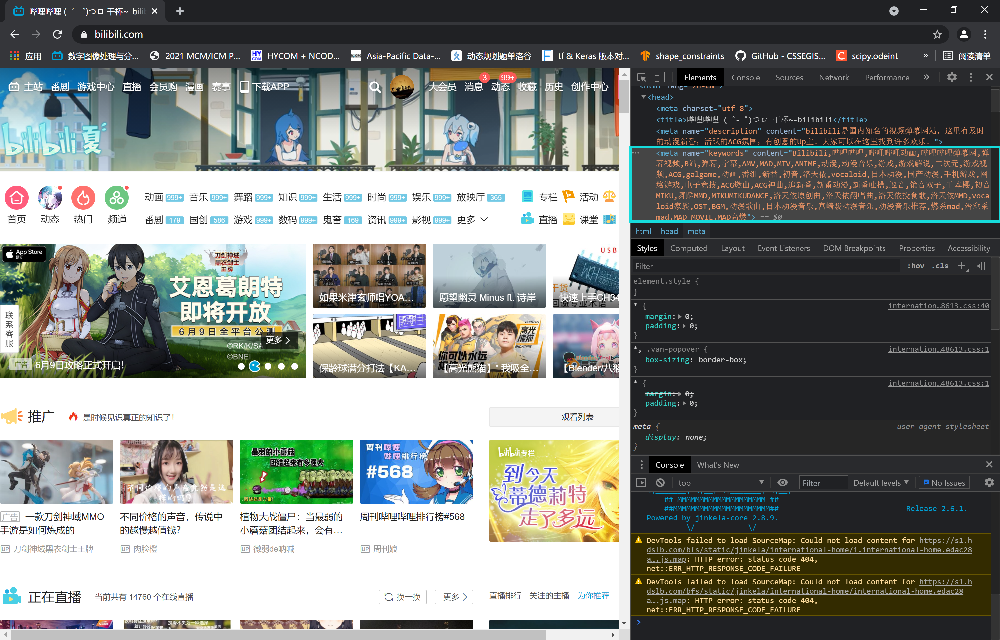

> ```html bilibili首页源代码节选
> <meta name="keywords" content="Bilibili,哔哩哔哩,哔哩哔哩动画,哔哩哔哩弹幕网,弹幕视频,
B站,弹幕,字幕,AMV,MAD,MTV,ANIME,动漫,动漫音乐,游戏,游戏解说,二次元,游戏视频,ACG,galgame,
动画,番组,新番,初音,洛天依,vocaloid,日本动漫,国产动漫,手机游戏,网络游戏,电子竞技,
ACG燃曲,ACG神曲,追新番,新番动漫,新番吐槽,巡音,镜音双子,千本樱,初音MIKU,舞蹈MMD,MIKUMIKUDANCE,
洛天依原创曲,洛天依翻唱曲,洛天依投食歌,洛天依MMD,vocaloid家族,OST,BGM,动漫歌曲,日本动漫音乐,
宫崎骏动漫音乐,动漫音乐推荐,燃系mad,治愈系mad,MAD MOVIE,MAD高燃" />
> ```
>
> 

今天偶然在睿站翻出来了首页的源代码，上面一段的 `<meta name="keywords" />` 标签是写在睿站的源码 `index.php` 里面的。

我们先通过菜鸟教程上的相关文档，康康在一个网页当中， `<meta name="keywords" />` 标签起着什么样的作用：



## 标签定义及使用说明

元数据（Metadata）是数据的数据信息。

`<meta>` 标签提供了 HTML 文档的元数据。元数据不会显示在客户端，但是会被浏览器解析。

META元素通常用于指定网页的描述，关键词，文件的最后修改时间，作者及其他元数据。

元数据可以被使用浏览器（如何显示内容或重新加载页面），搜索引擎（关键词），或其他 Web 服务调用。

## 提示和注释

注意：`<meta>` 标签通常位于 `<head>` 区域内。

注意： 元数据通常以键值对的形式出现。

注意： 如果没有提供 `name` 属性，那么键值对中的「键」会采用 `http-equiv` 属性的值。



由此可见，主页面的 `<meta name="keywords" />` 标签甚至可以说是整个网站的象征，

成为睿站之前的 bilibili 或者说 mikufans ，与其说是曾经以这些元素为主体，不如说其能够受人们喜爱之处尽皆在于这些。

我们曾经喜欢的 bilibili 已然不复存在，但它至少存在过，这块被遗忘的、未被修改过的 tag 便是其存在过的证明，

我们无法奢求 bilibili 变回曾经的 VU&ACGN 网站，但是我们可以把曾经得到的感动与置信铭记于心，砥砺前行。

```py
bilibili (゜-゜)つロ 乾杯~
bilibili.sayonara
```
