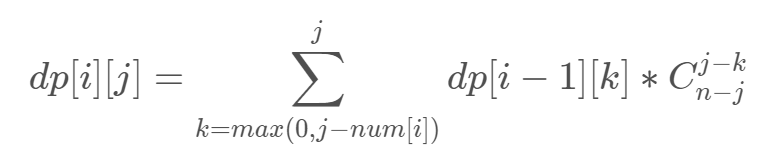

> 本题解为搬运`Forever誓`大佬(LuoguID: `52540`)的原创题解
>
> 也请多多支持原作: https://blog.csdn.net/forever_shi/article/details/89814096/
>
> 同时为中文、图片和代码的统一测试

## 题意

给你一个`n`，表示你要选出一个`n`个人组成的队列。有四种不同的人，人数分别是`a, b, c, d`个，保证`a + b + c + d >= n`。我们要求队伍里不能有连续的四个位置依次是第一种人、第二种人、第三种人和第四种人。求方案数，对`998244353`取模，而且有`n <= 1000, a, b, c, d <= 500`。

## 题解

难得自己做出来道题。

首先先考虑一些暴力的dp想法。我们可能会想记录当前这四种人分别站到队伍里了多少个，然后当前已经有了这四种人中连续的几种人的方案数。很显然的是，空间和时间都不允许。

于是我们换个思路，我们直接做不好做，我们就考虑用总方案数减去不合法的方案数。我们先考虑如何求总方案数。我们设`dp[i][j]`表示考虑了前`i`种人，已经占了`j`个位置的方案数。在转移时，我们并不能直接累加，因为我们在队伍里放进去若干个当前这种人的时候，位置是可以任意选的，所以要乘上一个组合数。我们设第`i`种人可以用`num[i]`个，那么可以列出转移方程式：

<!---->

$$ dp_{i , j} = \sum_{k = max(0 , j - num_i)}^j dp_{i - 1 , k} * C_{n - j}^{j - k} $$

这样我们就可以在`O(n^2)`的时间内算出这个总方案数了。

接下来我们考虑减去不合法的方案，我们发现可以容斥，我们用总方案数减去至少有一处出现不合法，其余位置随便放的方案数，加上至少有两处不合法，其他位置随便放的方案数，以此类推。我们已经会算`x`个位置，每种人可以用的数量已知的情况下怎么算总方案数，那么我们就考虑如何算有`n`个位置，选出`k`连续的四个位置的方案数。这个其实也是一个经典的组合数模型，我们可以预先对于每一组放上三个，这样就变成了`C_{n-k*3}^k`了。这样就可以计算出答案了。

复杂度的话，是`O(n^3)`的，实际来分析一下常数，应该会发现容斥的枚举次数上限是`n/4`，内层的话要枚举`4`次，每次枚举一个当前占了的位置数和上一次占了的位置数，这两个的差不超过`num[i]`，实际常数应该是不大的。再加上时限是`4`秒，就这么跑过去了，而且实测的话，似乎最慢的点也不到一秒。

## 标程 by `Froever誓`

```cpp
#include <bits/stdc++.h>
using namespace std;

int n,a,b,c,d,shu[5];
const long long mod=998244353;
long long ans,dp[5][1010],C[1010][1010];
int main()
{
	scanf("%d%d%d%d%d",&n,&a,&b,&c,&d);
	C[0][0]=1;
	for(int i=1;i<=n;++i)
	{
		C[i][0]=1;
		for(int j=1;j<=i;++j)
		C[i][j]=(C[i-1][j]+C[i-1][j-1])%mod;
	}
	int mn=min(a,b);
	mn=min(mn,c);
	mn=min(mn,d);
	mn=min(mn,n/4);
	for(int i=0;i<=mn;++i)
	{
		long long opt=1;
		if(i&1)
		opt=-1;
		memset(dp,0,sizeof(dp));
		shu[1]=a-i;
		shu[2]=b-i;
		shu[3]=c-i;
		shu[4]=d-i;
		for(int j=0;j<=shu[1];++j)
		dp[1][j]=C[n-4*i][j];
		for(int j=2;j<=4;++j)
		{
			for(int k=0;k<=n;++k)
			{
				for(int l=max(0,k-shu[j]);l<=k&&n-4*i-l>=0;++l)
				dp[j][k]=(dp[j][k]+dp[j-1][l]*C[n-4*i-l][k-l]%mod)%mod;
			}
		}
		ans=(ans+opt*dp[4][n-4*i]*C[n-3*i][i]%mod+mod)%mod;
	}
	printf("%lld\n",ans);
	return 0;
}
```
