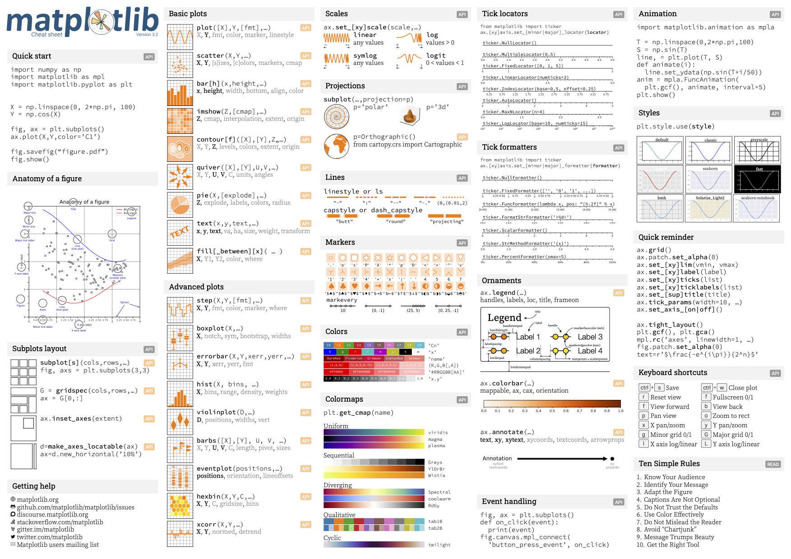
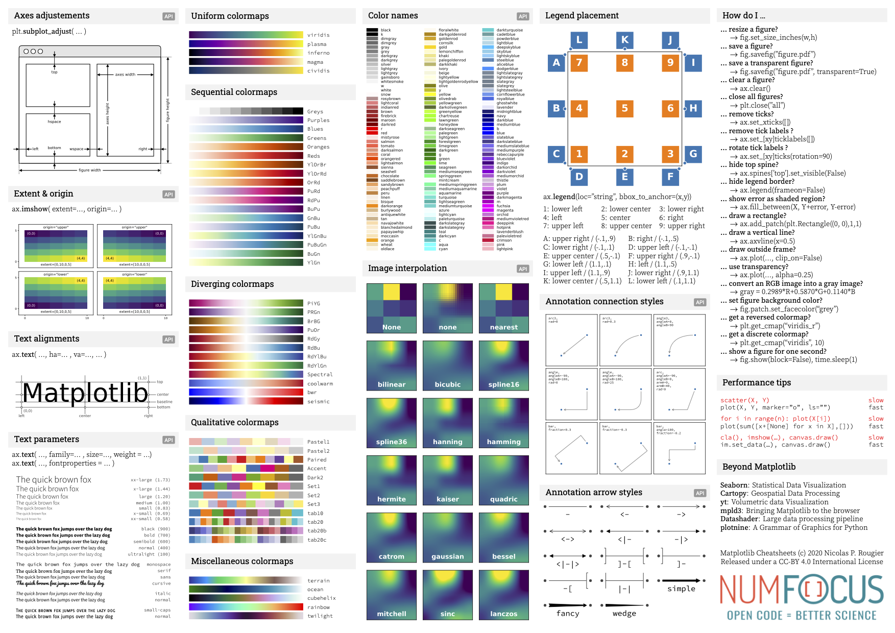
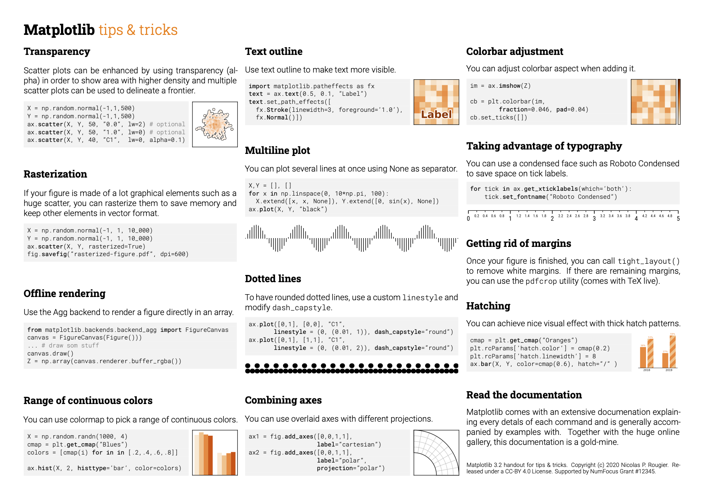

稍微写一点通过 `Matplotlib` 进行数据可视化相关的...

其实主要是从官方的 GitHub repo 上的搬运。

## Cheatsheets



## Handouts



## 我自己喜欢的一些神乎奇迹的操作

```py

```

## Others

参考文献：

* [1]: https://github.com/matplotlib/cheatsheets/
