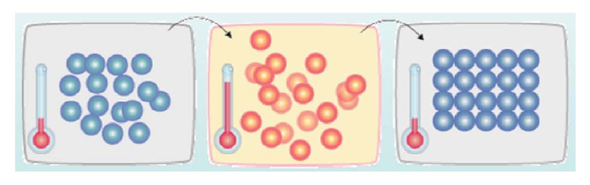
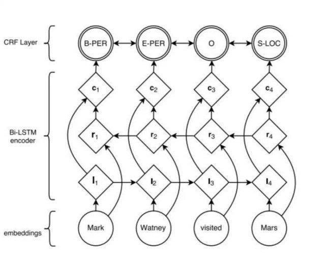

模拟退火算法(Simulate Anneal, SA)是一种通用概率演算法, 用来在一个大的搜寻空间内找寻命题的最优解, 该算法由S.Kirkpatrick, C.D.Gelatt和M.P.Vecchi于1983年提出, V.Černý在1985年也独立提出该算法。

## I. 退火

什么是退火?

我们看看来自百度百科的讲解:

> 退火是一种金属热处理工艺, 指的是将金属缓慢加热到一定温度, 保持足够时间, 然后以适宜速度冷却。
> 目的是降低硬度, 改善切削加工性; 降低残余应力, 稳定尺寸, 减少变形与裂纹倾向; 细化晶粒, 调整组织, 消除组织缺陷。
> 准确的说, 退火是一种对材料的热处理工艺, 包括金属材料, 非金属材料。
> 而且新材料的退火目的也与传统金属退火存在异同。

好吧，其实说白了就是这样的一张图:**千言万语不及一幅图啊!!!**

## II. 原理

既然是模拟退火, 其原理也和金属退火大同小异。

金属退火是让固体缓慢加热趋于无序自由, 再缓慢降温逐渐变得有序, 趋于基态, 此时固体的内能最小; 而SA便是*当你爬到一个一个局部最优解的时候, 你突发奇想, 破天荒地往山坡上方爬了爬, 发现远处有一个更优解, 而那便是你梦寐以求的全局最优解。*

就像这样:

你从山坡上的A点顺着梯度(普通优化方案)爬到了局部最低的山谷B点, 这个时候你逆梯度而上, 往右向上爬过了那个小山峰, 来到了最低的山谷C点。

SA在实际使用的过程中, 有一个状态转移准则, 来决定你是否要往右爬, 由一个Metropolis概率来表示:

$$p=\begin{cases}
  {E(x_{new}) < E(x_{old})}, & 1 \\
  {E(x_{new}) > E(x_{old})}, & \exp{(-\frac{E(x_{new})-E(x_{old})}T)}
\end{cases}$$

## III. 应用

事实上SA~~并没多大卵用~~有着**极为广泛的应用前景**, 包括:

* [最短路径问题(TSP)](https://baike.baidu.com/item/TSP/2905216)
* NLP, 也就是所谓自然语言处理中的语义分割(主要是英语)(就是你们说的分词)问题, 但语义分割一般会用[隐式马尔可夫模型(HMM)](https://baike.baidu.com/item/隐马尔可夫模型/7932524)或者条件随机场(CRF)之类的比较成熟的算法, 也不会有人~~吃饱了撑的~~用SA。
  
  目前语义分割中盛行的`CRF+LSTM`语义分割模型

(内容参考:

* https://baike.baidu.com/item/退火/1039313
* https://baike.baidu.com/item/模拟退火/8664695
* http://blog.csdn.net/wfrainn/article/details/80303138/
* https://www.cnblogs.com/tychyg/p/5277275.html
* https://www.cnblogs.com/ranjiewen/p/6084052.html

)
